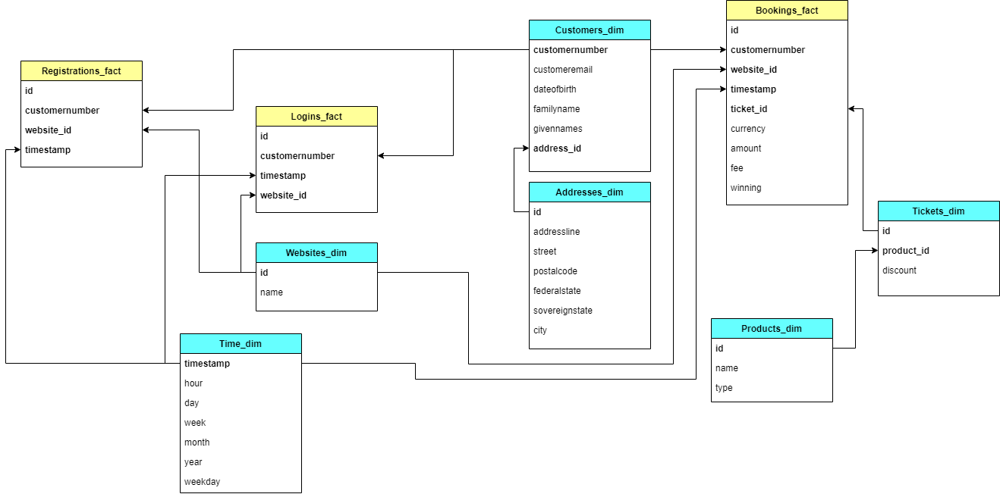

# Lottery data - Udacity Data Engineering Capstone Project

## Purpose/Goals

The company Lotto24 is an online provider of state licensed lotteries. From several servers, they log user activities (access and registration)
and purchases of different items. For this case study, only lottery tickets and instant games are considered.

The objective of this project is to create a datawarehouse where a star schema can be hosted for analytical investigation, along with a 
small data visualization notebook to run some queries on the database schema.

The datawarehouse will be implemented in AWS Redshift and it contains different types of tables:

    - *staging*: tables that contain the raw data loaded directly from the input files
    - *quarantine*: mirror tables to the *staging* ones, but contain problematic records that require further inspection
    - *production*: tables divided into dimension/fact tables to create the star schema for easy analytical investigation

The data visualization app is implemeted in Jupyter Notebook and run the follwoing queries:

    - Display information about active customer by certain time dimension (ex: day, week, month, etc..)
    - Display average customer basket amount
    - Display information about customer billing by certain dimension (ex: day, week, month, website, etc..)
    - Display monthly difference of customer billing 
    
The ETL is done via PySpark over to an EMR cluster.


## Schema design



### Main design

The database `lotterydb` holds information about bookings and user events (registrations and logins). The star schema is made of 3 fact tables and 6 dimension tables.
    - *fact tables*: `bookings`, `logins` and `registrations`
    - *dimension tables*: `customers`, `websites`, `time`, `products`, `tickets` and `addresses`


### Data assumptions

Some assumptions have been taken into account and they are investigated on the Jupyter notebook ( `notebooks/EDA.ipynb` ).

For the following staging tables, these columns have been considered important (constrain `NOT NULL`) when cleaned up:
  - customer_logins: entire column set
  - customer_registration: timestap, site, customeremail, dateofbirth, familyname, givennames, customernumber
  - games_purchase: timestap, siteid, customernumber, gamename, priceineur, feeineur, ticketexternalid
  - lottery_purchase: timestamp, site, customernumber, amountineur,feeamountineur, game, orderidentifier, tickertid

Inside customer_registration table, columns *timestamp* and *registrationdate* might be rendundant.
Inside lottery_purchase table, columns *amountincents* and *paymentamountincents* might be rendundant.
Pricing values are normalized to EUR across the tables.

The QA checks are based on the following assumptions:

- customer_logins:
    - all columns are necessary
    - no numbers on the website name
    - no letters on the customer number
    
- customer_registrations:
    - necessary columns are: timestamp, site, customeremail, familyname, givennames, customernumber, dateofbirth
    - no duplicates allowed on: customernumber and "customernumber + email"
    - email must be valid 
    
- instant games puchases:
    - necessary columns are: timestamp, sitetid, customernumber, gamename, ticketexternalid
    - no negative values allowed on: priceineur, feeineur, winningsineur
    
- lottery ticket purchases:
    - necessary columns are: timestampunix, site, customernumber, game, orderidentifie, ticketid
    - no negative values allowed on: amountincents, feeamountincents, paymentamountincents

Running the `EDA.ipynb` it is possible to see that there are some inconsistency in the raw data. In this project, records that do not conform with the QA standards will
be simply ignored. In other scenarios, the problematic records could be stored in `quarantine` tables used for manual inspections. This would provide the following advantages:

    - records are not simply discarded and everything is kept for possible future updates and corrections
    - records can be used for a cross-departament investigation to spot out problems that have passed unobserved (ex: implementation of some access points is faulty, some useful data is lost while it is expected to be captured, etc)
    - records won't compromise the ETL workflow when an error is discovered. Records fitted for the OLAP section of the datawarehouse can still be correctly used.

   
## How to run the project

1. Fill out the missing information from the `dl.cfg` file.
2. Create a S3 bucket where the output data will be stored and replace accordingly the value of `output_data` inside the script.
3. Create an EMR cluster via AWS Console with the follwoing specs:
    a. release *emr-5.20.0*
    b. 3 nodes (1 Master and 2 Slaves)
    c. make sure to have a paired key stored locally. Use that for security access.
    d. if the cluster is created via different machines, make sure to log onto the security group for the Master node and change the IP for the SSH inbound rule.
4. Connect to the created cluster via PuTTY or SSH command (always specify the paired key). SCP the  `dl.cfg` and `etl.py` onto the cluster. I personally use [WinSCP](https://winscp.net/eng/download.php)
5. After that run `spark-submit etl.py 1> spark.log` to run the pipeline on the EMR SSH console. It will collect the STDOUT into the `spark.log` file where it will be easier to debug any ETL issue on the fly.
6. When the ETL is completed, terminate the cluster via AWS Console.

## Query examples

1. Query number of songs in a given year
2. Query the average length of the longest 25 songs played per artist

```python
from pyspark.sql import SparkSession

spark = SparkSession \
        .builder \
        .config("spark.jars.packages", "org.apache.hadoop:hadoop-aws:2.7.0") \
        .getOrCreate()

q1 = "SELECT COUNT(*) from parquet.`s3a://data-lake-tables/songs_table.parquet/year=1964/*/*.parquet`"

res = spark.sql(q1).show()


parquetFile = spark.read.parquet("s3a://data-lake-tables/songplays_table.parquet/year=1964/*/*.parquet")

parquetFile.createOrReplaceTempView("parquetFile")

q2 = "SELECT song, AVG(duration) AS avg_duration FROM parquetFile GROUP BY song ORDER BY avg_duration LIMIT 25"

res = spark.sql(q2).show()
```

 
## Files in the repo

Important files inthe repository are:

- `data/`:
    - `customerlogins.csv`: customer login activities from different servers
    - `customerrestistration_xy.csv`: customer registration events from different servers
    - `instantgamespurchases.csv`: instant game purchases recorded from several servers
    - `lotterygamespurchases.csv`: lottery game tickets purchases from several servers
- `imgs`: contains the PNG of the star schema.
# - `dl.cfg`: contains configuration parameters for AWS.
